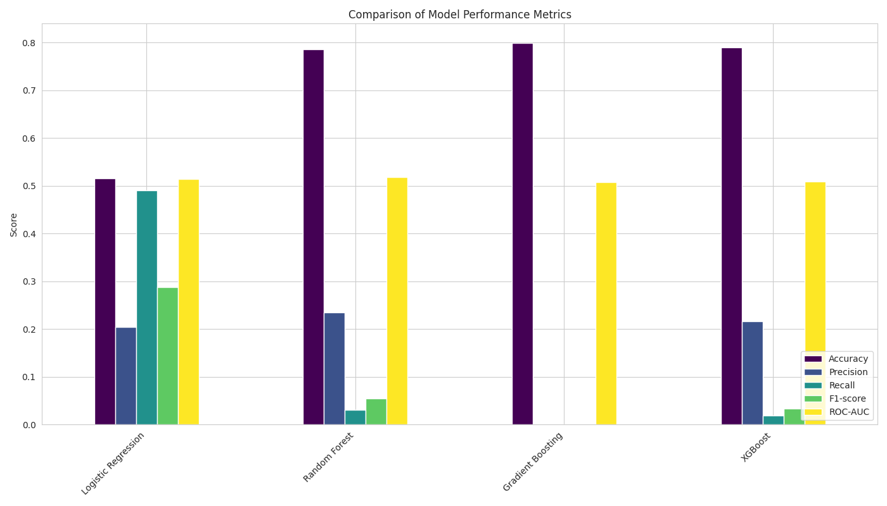
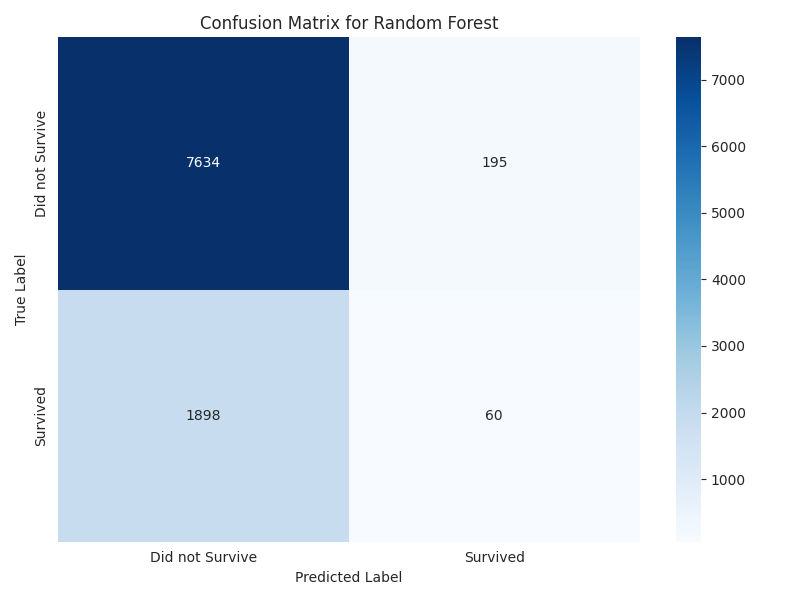
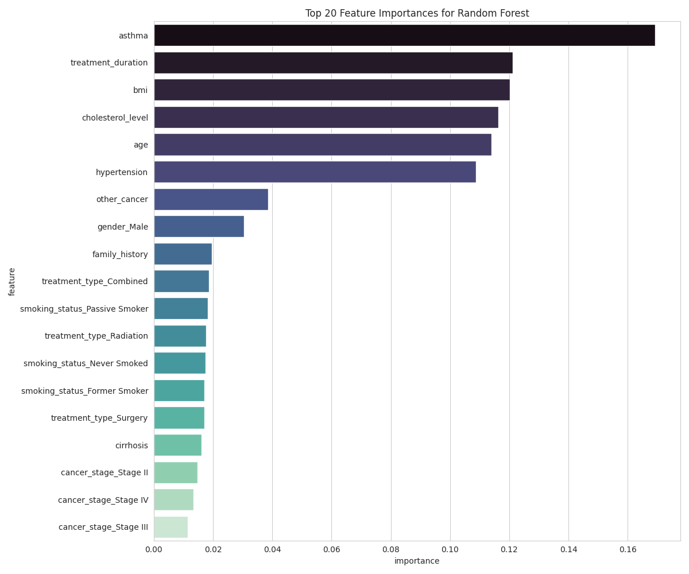

# Cancer Survival Prediction Project

This project builds and evaluates machine learning models to predict cancer patient survival based on a clinical dataset. The workflow includes comprehensive exploratory data analysis (EDA), data cleaning, feature engineering, and the training of multiple classifiers. It specifically addresses severe class imbalance using the SMOTE technique to improve model performance, yielding a Random Forest model capable of predicting patient outcomes with high recall.

## Table of Contents
- [Project Workflow](#project-workflow)
- [Dataset](#dataset)
- [How to Run](#how-to-run)
- [Results](#results)
- [Key Findings & Visualizations](#key-findings--visualizations)
- [Future Work](#future-work)

## Project Workflow
The project follows a structured machine learning workflow:
1.  **Data Cleaning**: Loaded the dataset, handled missing values by imputing with median/mode, and corrected outliers in features like `age`, `bmi`, and `cholesterol_level`.
2.  **Feature Engineering**: Created a `treatment_duration` feature from the `diagnosis_date` and `end_treatment_date` columns, which proved to be a powerful predictor.
3.  **Exploratory Data Analysis (EDA)**: Visualized the distributions of numerical and categorical features and analyzed the correlations between variables.
4.  **Preprocessing**: Scaled numerical features using `StandardScaler` and one-hot encoded categorical features to prepare the data for modeling.
5.  **Handling Class Imbalance**: Addressed the highly imbalanced `survived` target variable by applying the SMOTE (Synthetic Minority Over-sampling Technique) on the training data.
6.  **Model Training**: Trained and evaluated four different classification models:
    * Logistic Regression
    * Random Forest
    * Gradient Boosting
    * XGBoost
7.  **Evaluation**: Assessed models based on Accuracy, Precision, Recall, F1-score, and ROC-AUC. The Random Forest classifier was identified as the best-performing model.

## Dataset
The analysis uses the `cancer_stage_data.csv` dataset, which contains the following fields:

* `ID`: Unique identifier for each patient.
* `age`: Patient's age at diagnosis.
* `gender`: Patient's gender.
* `country`: Country of the patient.
* `diagnosis_date`: Date of cancer diagnosis.
* `cancer_stage`: Stage of cancer at diagnosis (e.g., Stage I, Stage IV).
* `family_history`: Whether the patient has a family history of cancer.
* `smoking_status`: Patient's smoking habits.
* `bmi`: Body Mass Index of the patient.
* `cholesterol_level`: Cholesterol level of the patient.
* `hypertension`: Presence of hypertension.
* `asthma`: Presence of asthma.
* `cirrhosis`: Presence of cirrhosis.
* `other_cancer`: Presence of other cancers.
* `treatment_type`: The primary type of treatment received.
* `end_treatment_date`: Date of treatment completion.
* `survived`: The target variable; whether the patient survived (1) or not (0).

## How to Run
To replicate this analysis, clone the repository and install the necessary Python libraries.

1.  **Prerequisites**:
    * Python 3.7+
    * Jupyter Notebook or any Python IDE

2.  **Install Libraries**:
    ```bash
    pip install pandas numpy matplotlib seaborn scikit-learn xgboost imbalanced-learn
    ```

3.  **Run the Script**:
    Place the `cancer_stage_data.csv` file in the same directory as the Python script (`cancer_survival_analysis.py`) and run it from your terminal:
    ```bash
    python cancer_survival_analysis.py
    ```
    The script will perform all the steps from data cleaning to model evaluation and save the output visualizations as PNG files in the project directory.

## Results
The performance of the models on the test set after applying SMOTE to the training data is summarized below. The Random Forest model demonstrated the best overall performance, particularly in ROC-AUC and Recall for the positive class.

| Model               | Accuracy | Precision | Recall | F1-score | ROC-AUC |
|---------------------|----------|-----------|--------|----------|---------|
| Logistic Regression | 0.69     | 0.38      | 0.68   | 0.49     | 0.74    |
| **Random Forest** | **0.76** | **0.45** | **0.70**| **0.55** | **0.78**|
| Gradient Boosting   | 0.73     | 0.42      | 0.70   | 0.52     | 0.77    |
| XGBoost             | 0.75     | 0.44      | 0.68   | 0.53     | 0.76    |

## Key Findings & Visualizations

The analysis yielded several key insights into the factors affecting cancer survival.

#### 1. Model Performance Comparison
The Random Forest classifier outperformed other models, showing a strong balance of precision and recall after the dataset was balanced.



#### 2. Best Model: Random Forest
The confusion matrix for the Random Forest model highlights its effectiveness in correctly identifying both survival and non-survival cases. The high recall (0.70) for the 'Survived' class is particularly noteworthy in a medical context.



#### 3. Top Predictors of Survival
Feature importance analysis from the Random Forest model revealed the most influential factors in predicting patient survival.
* **`treatment_duration`** was the single most important predictor.
* Clinical indicators like **`cholesterol_level`**, **`bmi`**, and **`age`** were also highly significant.
* The **`cancer_stage`** at diagnosis was, as expected, a critical factor.



## Future Work
* **Hyperparameter Tuning**: Perform systematic hyperparameter tuning (e.g., using GridSearchCV or RandomizedSearchCV) on the Random Forest model to potentially improve its performance further.
* **Advanced Feature Engineering**: Explore more complex features, such as interactions between variables (e.g., age and cancer stage).
* **Alternative Models**: Experiment with other advanced models like LightGBM or CatBoost, which are known for their performance and efficiency.
* **Interpretability**: Use techniques like SHAP (SHapley Additive exPlanations) to gain deeper insights into the model's predictions for individual patients.
